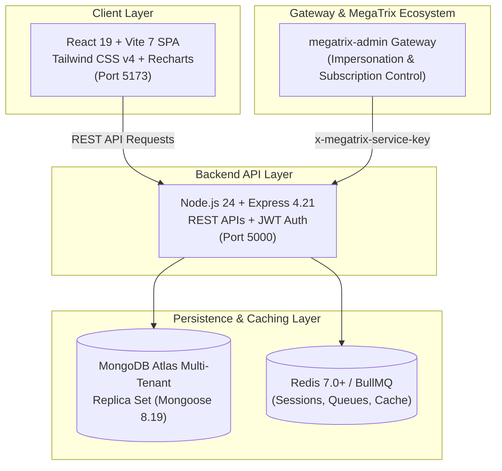

# 🧾 BizManager — Full Project Context & Architecture Guide
**Developed by MegaTrix**  
**Repository Path:** `D:\MegaTrix\bizmanager`  
**Generated Date:** September 19, 2026  
**Primary Documentation:** `README.md` | `docs/architecture.md` | `docs/PAGES_WORKING_GUIDE.txt`  
**Design Standards:** `GEMINI.md`

---

## 1. Executive Summary & Vision

**BizManager** (formerly *BizzAI*) is an enterprise-grade, multi-tenant Point of Sale (POS), Inventory, Billing, and Double-Entry Accounting ERP engineered specifically for retail businesses, grocery chains, wholesale distributors, and SMEs. It features first-class localized support for Pakistani retail and tax standards, including PKR currency formatting, FBR/GST invoice formats, and dedicated Udhaar Khata (credit ledger management).

It is part of the **MegaTrix SaaS ecosystem**, centrally connected with `megatrix-admin` via secure service-to-service keys, automated subscription paywall gatekeepers, and super-admin tenant impersonation.

---

## 2. Technology Stack & System Architecture



### Frontend Stack (`frontend/`)
- **Core**: React 19 (`19.1.1`), Vite 7 (`7.1.7`), React Router v7 (`7.9.4`).
- **Styling**: Tailwind CSS v4 (`@tailwindcss/vite` 4.1.14), PostCSS 8, responsive dark/light themes with double-bezel elevated cards.
- **State Management**: Redux Toolkit (`2.9.0`), React-Redux (`9.2.0`), dedicated Contexts (`ThemeContext`, `LanguageContext`, `ModeContext`).
- **Data & Visuals**: Recharts (`3.7.0`), JSBarcode (`3.12.3`), QRCode.react (`4.2.0`), jsPDF & AutoTable for client-side invoice printing, XLSX for spreadsheet import/export.
- **Internationalization**: `i18next` with Urdu / English toggle support.

### Backend Stack (`backend/`)
- **Runtime & Web Framework**: Node.js (ESM), Express.js v4.21, Morgan HTTP logging.
- **Database & Modeling**: MongoDB, Mongoose v8.19, compound tenant indexing, ACID multi-document transactions.
- **Security & Hardening**: Helmet (strict CSP & HSTS), Express Mongo Sanitize (NoSQL injection prevention), Express Rate Limit, Cookie-Parser (HttpOnly signed cookies), Bcryptjs password hashing, JWT access + refresh tokens.
- **Monitoring & Error Tracking**: Sentry (`@sentry/node` 7.99 / `@sentry/react` 10.34), Winston file/console logger.
- **Document Generation**: PDFKit v0.17 for backend invoice rendering, ExcelJS v4.4 for financial reporting.

---

## 3. Core Functional Domains & Modules

BizManager encompasses **13 core business modules** spanning retail, wholesale, finance, and governance:

### 1. Point of Sale (POS) & Billing (`frontend/src/pages/POS.jsx`)
- High-speed retail checkout screen supporting barcode/SKU scanning.
- Instant item search, category pill filtering, cart line-item discounts, and overall bill discount.
- Multi-payment support: Cash, Bank Transfer, UPI, Credit (Udhaar), and split payments.
- Real-time stock decrement upon checkout with thermal receipt & full A4 invoice printing.

### 2. Inventory & Stock Ledger (`backend/models/Item.js`, `StockLedger.js`)
- Item catalog with SKU, barcode, unit types (pcs, kg, litre, box, etc.), purchase cost, and selling price.
- Automatic profit margin and markup calculator.
- Low stock threshold alerts and real-time inventory adjustments.
- Complete Stock Ledger and Stock Movements history tracking opening, incoming, outgoing, and closing quantities.

### 3. Customer Management & Udhaar Khata (`frontend/src/pages/UdhaarKhata.jsx`)
- Comprehensive customer profiles, contact numbers, and transaction history.
- Dedicated Udhaar Khata (Credit Ledger) tracking outstanding balances, dues, and payment installments.
- Due adjustment vouchers and payment receipt issuance (`PaymentIn`).

### 4. Supplier Management & Advances (`frontend/src/pages/Suppliers.jsx`)
- Vendor directory with tax identification numbers, addresses, and balance ledgers.
- Supplier Advance payments management (`SupplierAdvance`) with automatic deduction on purchase bills.

### 5. Full Sales Lifecycle (`frontend/src/pages/sales/`)
- **Estimates / Quotations**: Proforma invoicing convertible directly to confirmed sales orders or final invoices.
- **Sales Orders**: Booking bulk client orders with fulfillment tracking.
- **Delivery Challans**: Dispatch tracking and transport documentation.
- **Sales Invoices**: Tax-compliant commercial invoices with payment status (Paid, Unpaid, Partial).
- **Sales Returns & Credit Notes**: Return merchandise authorization, restock options, and credit notes.

### 6. Full Purchase & Procurement Lifecycle (`frontend/src/pages/purchase/`)
- **Purchase Orders (PO)**: Vendor purchase requisitions and order tracking.
- **Goods Received Notes (GRN)**: Warehouse intake verification matching physical shipments against POs.
- **Quality Inspection (QI)**: Accepted vs rejected quantity tracking prior to inventory ingestion.
- **Purchase Bills / Invoices**: Accounts payable tracking with aging analysis (0-30, 31-60, 61-90, 90+ days).
- **Payment Out**: Settlement vouchers against vendor bills via bank or cash accounts.
- **Purchase Returns & Debit Notes**: Returning defective goods with debit note generation.

### 7. Cash & Bank Operations (`frontend/src/pages/cashbank/`)
- Multi-bank account tracking with live balances.
- Daily Cash-in-Hand register (Cashbook).
- Internal Fund Transfers between accounts with audit trail.
- Cheque register (Issued vs Received) with status lifecycle (Pending, Cleared, Bounced).
- Bank Reconciliation statements.

### 8. Governance, Approvals & Period Locking (`backend/models/ApprovalWorkflow.js`, `FinancialPeriod.js`)
- **Maker-Checker Workflows**: Mandatory manager approval for transactions exceeding custom thresholds (e.g. expenses > PKR 50,000, high-value returns).
- **Financial Period Locking**: Freezing monthly/quarterly fiscal periods to prevent retroactive tampering or modifications of closed books.
- **Immutable Audit Logging**: Every critical action (`CREATE`, `UPDATE`, `DELETE`, `IMPERSONATE`) is recorded with user IP, user agent, and timestamp in `AuditLog.js`.

### 9. Business Intelligence & Reports (`frontend/src/pages/Reports.jsx`)
- Executive KPI dashboard, sales trends, top-selling items, and profit & loss analysis.
- Financial Statements: Balance Sheet, Trial Balance, Cashflow Statement, and Stock Valuation.
- FBR / GST tax summary reports.

---

## 4. Multi-Tenancy & MegaTrix Integration

1. **Tenant Context Scoping (`backend/middlewares/tenantContext.js`)**:
   - Each business operates under an `Organization` record.
   - All critical queries automatically inject `{ organizationId: req.user.organizationId }` to guarantee zero cross-tenant data leakage.
2. **Server-Side Subscription Gate (`backend/middlewares/subscriptionMiddleware.js`)**:
   - Business routes are wrapped with `requireActiveSubscription`. If an organization's subscription plan has expired, requests are rejected with a 402/403 paywall status, rendering `SubscriptionExpired.jsx` on the client.
3. **Super-Admin Remote Gateway (`backend/routes/impersonateRoutes.js`)**:
   - Secured by `x-megatrix-service-key` matching `MEGATRIX_SERVICE_SECRET`.
   - Allows the centralized `megatrix-admin` portal to securely inspect tenant health and generate one-time impersonation tokens for customer support.

---

## 5. UI/UX Design System Guidelines (`GEMINI.md`)

The project strictly follows the **Anti-AI Design & Taste Rails**:
- **Double-Bezel Architecture (Doppelrand)**: Elevated card containers feature concentric calculated radii (`rounded-[calc(2rem-0.375rem)]`) with soft layered borders (`border-slate-200/80` or `border-white/[0.08]`).
- **Tabular Numerics**: All currency values (PKR), stock counts, timestamps, and metric cards enforce `font-mono tabular-nums` for rock-solid visual alignment.
- **Optical Tightening**: Headings use tightened letter spacing (`tracking-[-0.03em]`).
- **Clean Enterprise SaaS**: No generic rainbow gradients or gimmicky AI sparkle badges; interfaces utilize deep zincs (`#09090b`), slate contrasts, and purposeful micro-interactions.

---

## 6. Directory Structure at a Glance

```
D:\MegaTrix\bizmanager/
├── backend/
│   ├── config/               # DB, Sentry, CORS, and Env validation
│   ├── controllers/          # 35+ Business logic controllers
│   ├── middlewares/          # Auth, TenantContext, SubscriptionGate, Security, ErrorHandler
│   ├── models/               # 41 Mongoose schemas (Double-entry ERP & Inventory)
│   ├── routes/               # 35 REST route handlers
│   ├── utils/                # Logger, PDFKit generator, Email service, Password hash
│   ├── server.js             # Server startup & graceful shutdown
│   └── app.js                # Express app configuration & middleware pipeline
├── frontend/
│   ├── src/
│   │   ├── components/       # Reusable UI cards, tables, modals, navbar, sidebar
│   │   ├── contexts/         # Theme, Language, Mode providers
│   │   ├── pages/            # 40+ Pages (POS, Inventory, Sales, Purchase, Udhaar, Reports)
│   │   ├── redux/            # Store and feature slices
│   │   ├── utils/            # Axios API client, currency formatters, barcode helpers
│   │   └── App.jsx           # Client-side router & lazy-loaded routes
├── docs/                     # Architecture, Deployment, Incident Response, Pages Guide
└── package.json              # Root workspace orchestrator
```

---

## 7. How to Run BizManager Locally

```bash
# From D:\MegaTrix\bizmanager:
# Run both Backend (port 5000) and Frontend (port 5173) concurrently:
npm run dev

# Or independently:
npm run dev:backend   # Starts backend on http://localhost:5000
npm run dev:frontend  # Starts frontend on http://localhost:5173
```

- **Default Test / Demo Account**: `demo@bizzai.com` / `Demo@123`
- **Health Check Endpoint**: `http://localhost:5000/api/health`
